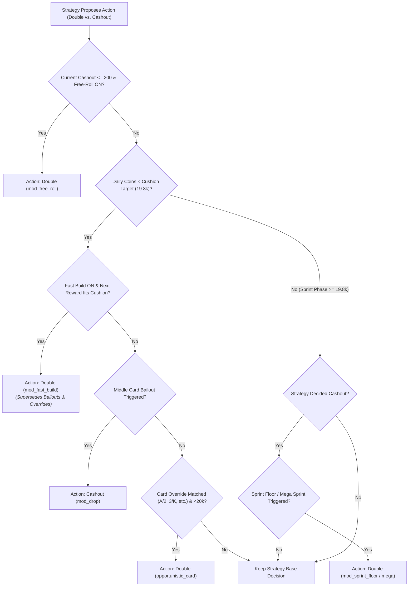

# AGENTS.md — AI Assistant Guide for Hololive Dreams Auto Bot

This document provides architectural context, development guidelines, game mechanics, and test instructions for AI coding assistants working in this repository.

---

## 1. Quick Reference & Commands

- **Operating System**: Windows (Win32 background capture, DPI scaling).
- **Shell**: PowerShell (`pwsh`).
- **Python Version**: 3.10+ (tested through 3.14).
- **Virtual Environment**: `. .venv` (activates workspace environment).
- **Run Application**:
  ```powershell
  python main_ui.py
  ```
- **Run Test Suite** (mandatory before committing any code changes):
  ```powershell
  powershell -Command ". .venv; python -m unittest discover tests"
  ```
- **Build Executable**:
  ```powershell
  ./build.ps1
  ```

---

## 2. Core Game Rules & System Invariants

1. **Ticket & Entry**:
   - Entry fee is **50 coins** per poker round.
   - 5-Card Draw with a 53-card deck (52 standard cards + 1 Joker).
   - Minimum qualifying payout: **Two Pair (200 coins)**. Hands below Two Pair forfeit the ticket.
2. **High-Low Doubling Mechanics**:
   - A base card is revealed (ranks 2 through Ace / 14).
   - The player guesses whether the hidden card will be **High** or **Low**.
   - **Ties are Losses**: Drawing a card of the exact same rank as the base card wipes out the entire accumulated round payout.
3. **The 20,000 Coin Daily Cap Overflow Rule**:
   - The game's 20k limit **only prevents starting a new poker round**.
   - Any round initiated while daily coins are $< 20,000$ runs to completion without cap restriction.
   - **Two-Phase Structure**:
     - **Cushion Phase** ($< 19,800$ coins): Conservative grinding to build a solid cushion near 19,800 without crossing 20,000.
     - **Sprint Phase** ($\ge 19,800$ coins): Unlocks aggressive doubling targeting single-round payouts of 10k–32k+, yielding **29,000 to 32,000+** total daily coins.
4. **Daily Rollover Cycle**:
   - Resets daily at **4:00 PM EST** via `get_game_date()` in `src/auto_bot.py`. Bot automatically resets coin/fail counters across rollover.

---

## 3. Architecture & Codebase Map

```text
├── main_ui.py                 # Modern Tkinter GUI (canvas glassmorphism, tab manager, tooltips)
├── src/
│   ├── auto_bot.py            # Automation state machine, template detection, and click dispatch
│   ├── window_control.py      # Multi-resolution DPI scaling (Per-Monitor V2) & Win32 capture
│   ├── simulation.py          # Offline Monte Carlo simulator & strategy benchmark suite
│   ├── localization.py        # Dynamic JSON-based i18n localization engine
│   ├── poker_core.py          # Numba JIT accelerated combinatorial 5-card poker hand solver
│   ├── reward_vision.py       # Real-time cyan HSV OCR for challenge and settlement numbers
│   ├── settlement.py          # Payout verification, expected value validation, and OCR recovery
│   └── strategies/            # 7 modular doubling policies + modifiers engine
│       ├── base.py            # BaseStrategy abstract base class
│       ├── max_profit.py      # Max Profit (~29-32k cushion/sprint, recommended default)
│       ├── fastest_clear.py   # Fastest Clear (all-or-nothing ~20k-22k speedrun)
│       ├── balanced.py        # Balanced (staged build/push/sprint ~25k-28k)
│       ├── aggressive_balanced.py # Aggressive Balanced (~28k-30k)
│       ├── adaptive_rush.py   # Adaptive Rush (~25k-32k with auto-downshifting)
│       ├── grinder.py         # Grinder (ultra-safe capped doubles, slow grind)
│       ├── custom_parametric.py # Custom Parametric (user-configured win rates & limits)
│       └── modifiers.py       # Modifier rules engine (Fast Build, Sprint Floors, Bailouts)
├── locales/                   # Translations: en.json, zh.json, tw.json, ja.json
├── backgrounds/               # Custom UI backgrounds (auto-detected, cyclic selection)
├── assets/                    # Static assets & application icons
├── templates/                 # OpenCV template matching reference images
└── tests/                     # 16 unit & integration test files (129 tests)
```

---

## 4. Strategy Modifier Precedence & Hierarchy

The modifier engine in `src/strategies/modifiers.py` (`evaluate_modifiers`) follows strict operational precedence:



### UI Mutual Exclusion Rules
- Enabling **Fast Build** automatically disables and greys out all 7 **Card Overrides** and all 3 **Defensive Bailouts** in `main_ui.py` (`_sync_modifier_states`), because Fast Build already forces doubles under cushion.
- Defensive Bailouts are mutually exclusive with each other: selecting `Bail 6/7/8/9` unchecks `7 & 8` and `8 only`.
- Sprint Floors are mutually exclusive: selecting `Mega Sprint (≥12.8k)` unchecks `Sprint Floor (≥11.2k)`.

---

## 5. Development & Contribution Standards

1. **Line Endings & Formatting**:
   - Use standard LF line endings (`\n`) for all python files.
   - Preserve existing inline comments, docstrings, and logic.
2. **Localization Parity**:
   - Every key in `locales/en.json` must exist with identical naming and format placeholders (e.g. `{cashout}`, `{reward}`) in `zh.json`, `tw.json`, and `ja.json`.
   - Verified by `tests/test_localization.py`.
3. **Threading & UI Safety**:
   - `main_ui.py` runs Tkinter on the main thread. Background automation loops (`auto_bot.py`, `simulation.py`) must send UI updates and log messages via `self._ui_queue` or `after()`.
4. **Resolution-Independent Coordinates**:
   - Never hardcode screen pixel positions. All screen reads and clicks must pass through `window_control.py` normalized to 1080p reference bounds and scaled dynamically.
