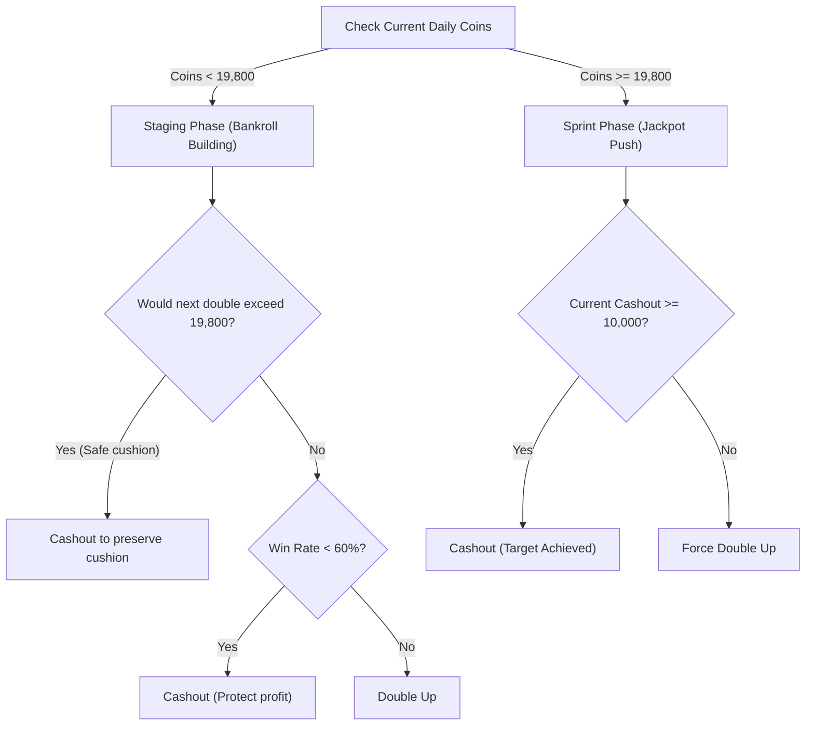

# 1.0.1 Legacy Strategy Guide

In the strategy dropdown menu, select **"1.0.1 Legacy"** (default option).

---

## Strategy Overview

The **1.0.1 Legacy** strategy is the original, dynamic real-time decision engine. Unlike the fixed win-count progression of the Three-Stage strategy, the Legacy strategy calculates risk and doubling decisions on every turn using:
- **Card Counting Probabilities**: Real-time remaining card odds computed by [`HighLowCounter`](file:///y:/Code/Hololive-Dreams-Auto-High-Low/src/auto_bot.py#L214). Drawing an equal-rank card in the High-Low game results in a loss; therefore, remaining cards of the same rank are counted in the denominator to evaluate the mathematically exact win probability $P(\text{Win}) = \frac{\text{favorable cards}}{\text{total remaining cards}}$.
- **OCR Payout Tracking**: Reads the current cashout pool and the double-or-nothing potential payout from the screen.
- **Two-Phase Bankroll Management**: Distinguishes between building a safe cushion (**Staging Phase**) and going for a massive final payout (**Sprint Phase**).

---

## Two-Phase Risk Management

### 1. Staging Phase (`daily_coins < 19,800`)
The goal is to safely build up daily coins just below the 20,000 daily cap without prematurely crossing it.

- **Cushion Protection**:
  If `daily_coins + current_cashout <= 19,800` but `daily_coins + next_reward > 19,800`:
  The bot immediately cashes out to secure the profit right beneath 19,800. This ensures maximum room for the subsequent Sprint Phase.
- **Over-Cap Overflow Check**:
  If `daily_coins + current_cashout > 19,800`:
  - If `current_cashout >= 10,000`: Cashes out immediately (lucky jackpot).
  - If `current_cashout < 10,000`: Forces another double. Cashing out small amounts when over 19,800 would waste the daily cap; the bot gambles for a larger jackpot.
- **Dynamic Odds Filter**:
  - **Win Rate < 60%**: Cashes out early to lock in profits.
  - **Win Rate &ge; 60%**: Continues doubling.
  - **Blind / Round 1**: Doubling is forced by default when card prediction is not yet available.

---

### 2. Sprint Phase (`daily_coins >= 19,800`)
Once total daily coins reach 19,800 or more, the bot transitions to **Sprint Mode**.

> [!TIP]
> The game's 20,000 daily limit only prevents starting a new game once reached. Any coins won during a currently running game are credited in full, allowing players to exceed 30,000+ total coins in a single day!

- **Target**: Pushes for a single massive cashout &ge; 10,000 coins.
- **Cashout Trigger**: Cashes out immediately once `current_cashout >= 10,000`.
- **Aggressive Doubling**: While `current_cashout < 10,000`, the bot ignores low-odds cashout rules and keeps doubling until either the jackpot threshold is achieved or the game forces automatic settlement.

---

## Decision Matrix Summary

| Game State | Condition | Decision | Rationale |
|:---|:---|:---:|:---|
| **Round 1 / Blind** | No card prediction available | **Double** | Maximize expected value on initial step |
| **Staging** (`< 19.8k`) | Next win would push total > 19,800 | **Cashout** | Lock in cushion right under the cap |
| **Staging** (`< 19.8k`) | Win rate < 60% | **Cashout** | Protect accumulated round profit |
| **Staging** (`< 19.8k`) | Win rate &ge; 60% and total safe | **Double** | Mathematically favorable continuation |
| **Sprint** (`>= 19.8k`) | Current cashout &ge; 10,000 | **Cashout** | Ultimate target reached |
| **Sprint** (`>= 19.8k`) | Current cashout < 10,000 | **Double** | Push for the maximum single-run payout |

> [!NOTE]
> **Opportunistic High-Chance Doubling Override:**
> When an early cashout would otherwise occur, if the revealed card matches an active toggle (e.g. `A & 2`, `3 & K`, `4 & Q`) and the post-win balance remains strictly under the daily limit (`daily_coins + next_reward < target_limit`, max 19,800), the bot overrides the cashout to challenge. Hitting 20,000 is blocked so the Sprint Phase is never forfeited.

---

## Comparison: Legacy vs. Three-Stage

| Feature | 1.0.1 Legacy | Three-Stage Doubling |
|:---|:---|:---|
| **Progression** | Dynamic probability & real-time OCR | Fixed 3-stage milestone plan |
| **Daily Target Strategy** | Cushion at 19.8k &rarr; Sprint for 10k+ | Maximize &rarr; Win Count target &rarr; Maximize |
| **OCR Sensitivity** | Relies on reading real-time prize text | Reads initial payout once per round |
| **Ideal For** | Users wanting odds-based adaptive play | Users wanting predictable, deterministic runs |

---

## Credits

- Original strategy design and implementation by [Akai](https://github.com/xAkai97).
