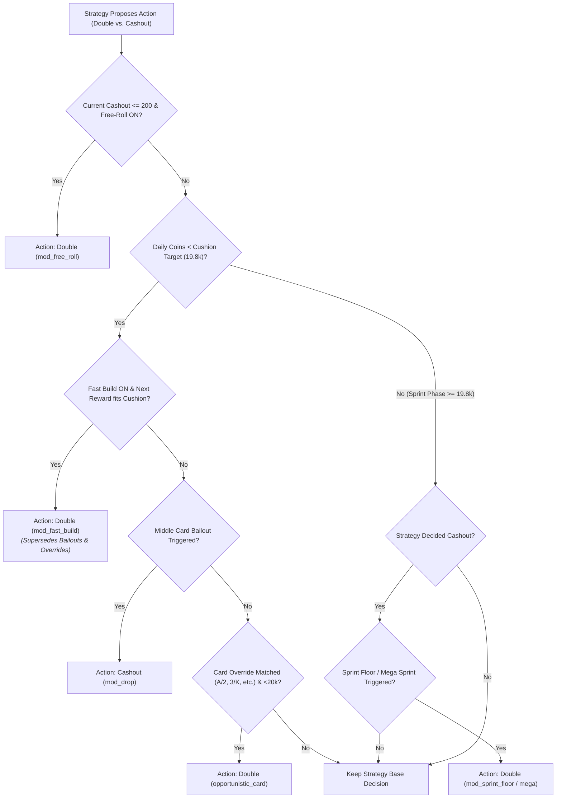

# Hololive Dreams Auto High & Low — Strategy Guide

## Game Rules

| Rule | Value |
|------|-------|
| **Double-up cap** | ~10,000 coins per round (game auto-settles) |
| **Daily earning cap** | 20,000 coins (soft — can't start a new round once reached) |
| **Overshoot** | Allowed — final win is fully credited even if it exceeds 20k |
| **Unlimited plays** | No limit on rounds, only on daily total |

> **Optimal daily max:** ~32,000 coins — earn ~19,800 in small cashouts, then max double-up (~12,800) on the final round.

---

## Available Strategies

### 1. Max Profit (`max_profit`)

Maximizes daily profit to ~32,000 coins. The recommended default strategy:

- **Cushion** (daily < 19,800): Safe cashouts, guard against overshooting 19,800
- **Sprint** (daily ≥ 19,800): Chase 10k+ cashout, ignore win rate

**Expected:** ~29k-32k | **Risk:** Medium-High | **Time:** Medium-Long

---

### 2. Fastest Clear (`fastest_clear`)

Reach 20,000+ coins as fast as possible. All-or-nothing:

- Every round goes for max double-up (game auto-settles at ~10k cap)
- Only cashout if doing so reaches the daily cap
- Stop when daily ≥ 20,000

**Expected:** ~20k-22k | **Risk:** Highest | **Time:** Fastest (2-3 good rounds)

---

### 3. Balanced (`balanced`)

Reliable ~25,000 coins with moderate risk:

- **Build** (daily < 15,000): Cashout at 6,400+, win rate floor 55%
- **Push** (15k ≤ daily < 19,800): Higher threshold, win rate floor 50%
- **Sprint** (daily ≥ 19,800): Max double-up for 10k+

**Expected:** ~25k-28k | **Risk:** Moderate | **Time:** Medium

---

### 4. Aggressive Balanced (`aggressive_balanced`)

Like Balanced but pushes harder:

- **Build** (daily < 12,000): Cashout at 6,400+, win rate floor 50%
- **Push** (12k ≤ daily < 19,800): Let rounds ride, win rate floor 45%
- **Sprint** (daily ≥ 19,800): Max double-up for 10k+

**Expected:** ~28k-30k | **Risk:** Medium-High | **Time:** Medium

---

### 5. Adaptive Rush (`adaptive_rush`)

Starts aggressive, auto-downshifts if failing too much:

- **Rush mode (default):** Max double-up every round (like Fastest)
- **Auto-adjust triggers:** 5+ consecutive fails OR net profit < -1,500
- **Cushion mode (fallback):** Small cashouts (3,200+), win rate floor 55%
- **Sprint** (daily ≥ 19,800): Max double-up for 10k+

Once in cushion mode, stays there (no switching back).

**Expected:** ~25k-32k | **Risk:** Self-adjusting | **Time:** Adaptive

---

### 6. Grinder (`grinder`)

Ultra-safe, minimum risk:

- **Build** (daily < 19,800): Cashout at 1,600+, max 4 doubles per round, win rate floor 60%
- **Sprint** (daily ≥ 19,800): One final max double-up attempt

**Expected:** ~20k-25k | **Risk:** Lowest | **Time:** Longest

---

### 7. Custom Parametric (`custom_parametric`)

Fully user-configurable strategy. Set your own parameters via the GUI:

| Parameter | Config Key | GUI Default | Description |
|-----------|-----------|-------------|-------------|
| Cushion Target | `param_cushion_target` | 19,800 | Target cap room before switching to sprint |
| Min Win Rate | `param_min_win_rate` | 60 (%) | Minimum win rate before forced cashout |
| Sprint Target | `param_sprint_target` | 10,000 | Min cashout to accept during sprint |
| Max Doubles | `param_max_doubles` | 10 | Max doubles per round |
| Drop on 7/8 | `param_drop_seven_eight` | false | Always cashout when facing a 7 or 8 |

**Expected:** Varies | **Risk:** User-defined | **Time:** Varies

---

## Strategy Modifiers & Collapsible Drawer

In addition to each strategy's built-in decision tree, the bot provides a collapsible **Strategy Modifiers** drawer directly on both the **Auto Bot** and **Simulation** tabs in the main UI.

The drawer is divided into three distinct collapsible categories (`▼` / `▶` toggle on header click):

### 1. Progression & Sprint Phase (Collapsible)
- **Fast Build (`mod_fast_build`)**: Forces maximum doubling throughout the cushion phase ($< 19,800$) as long as the next payout fits within 19,800, rapidly accelerating bankroll accumulation from Two Pair hands.
- **Free-Roll (`mod_free_roll`)**: Forces doubling on round payouts of 200 or less (initial Two Pair qualifying payout) regardless of the card drawn, turning minimal payouts into high-value opportunities with zero downside.
- **Sprint Floor 11.2k+ (`mod_sprint_floor`)**: During the sprint phase ($\ge 19,800$), refuses cashouts under 11,200 and forces doubling to guarantee a total daily finish of at least 30,000 coins.
- **Mega Sprint 12.8k+ (`mod_mega_sprint`)**: During the sprint phase ($\ge 19,800$), refuses cashouts under 12,800 and forces doubling to target the maximum 32,000+ daily cap (mutually exclusive with Sprint Floor).

### 2. Defensive Bailouts (Collapsible, Under 19.8k Cushion)
Provides immediate cashout protection on volatile middle cards during the cushion phase, avoiding 50/50 wipes:
- **Bail on 8 only (`mod_drop_8`)**: Cashes out only when dealt card 8 (47.1% unfavorable odds due to tie-losses), while allowing 7 and 9 to continue.
- **Bail on 7 & 8 (`mod_drop_78`)**: Cashes out whenever dealt 7 or 8 to avoid coin-flip trap cards.
- **Bail on 6/7/8/9 (`mod_drop_6789`)**: Ultra-safe grinding policy that cashes out on any middle card (6 through 9; $\le 62.7\%$ win rate).

### 3. Card Overrides (Collapsible, Double Under Cap)
Whenever the active strategy proposes a **Cashout**, the bot inspects the visible base card before accepting payout. If the card matches an enabled override and post-double coins remain strictly under the daily cap ($< 20,000$), the bot **overrides the cashout** to continue doubling:

| Override Tier | Target Cards | 52-Card Win Odds (Ties Lose) | Risk Rating |
|:---|:---|:---:|:---:|
| **A & 2** *(Default ON)* | Ace (14) & 2 | **94.1%** (48 / 51) | Near Certain |
| **3 & K** *(Default ON)* | 3 & King (13) | **86.3%** (44 / 51) | Highly Favorable |
| **4 & Q** *(Default ON)* | 4 & Queen (12) | **78.4%** (40 / 51) | Favorable |
| **5 & J** | 5 & Jack (11) | **70.6%** (36 / 51) | Aggressive Build |
| **6 & 10** | 6 & 10 | **62.7%** (32 / 51) | High Risk |
| **7 & 9** | 7 & 9 | **54.9%** (28 / 51) | Near Coin-Flip |
| **8** | 8 | **47.1%** (24 / 51) | Unfavorable (Extreme Risk) |

#### Strict Lockout Prevention Guard
$$\text{daily\_coins} + \text{next\_reward} < \text{target\_limit}$$
- With the default 20,000 target limit, the maximum post-double payout allowed under an override is **19,800**.
- Landing on or over 20,000 on the dot (e.g. `18,400 + 1,600 = 20,000`) is strictly **disallowed**. This guarantees the bot never locks itself out of starting the final round, preserving the opportunity to sprint for a 10,000+ overflow payout.

### 4. UI Mutual Exclusion Logic
To eliminate conflicting automated decisions, the UI enforces automatic mutual exclusion:
- **Fast Build > Overrides & Bailouts**: Enabling *Fast Build* forces doubling on all cards under cushion (19,800), automatically greying out and superseding all Card Overrides and Defensive Bailouts.
- **Defensive Bailouts > Overrides**: Enabling *Bail 6/7/8/9* automatically unchecks and disables *6/10*, *7/9*, and *8*; enabling *Bail 7/8* disables *7/9* and *8*; enabling *Bail 8* disables *8*.
- **Overrides > Bailouts**: Enabling a middle-card override (*8*, *7/9*, or *6/10*) automatically unchecks contradictory bailouts.
- **Sprint Floors**: Enabling *Mega Sprint* automatically unchecks *Sprint Floor*, and vice versa.

---

## Quick Comparison

| Strategy | Expected | Risk | Time | Best For |
|----------|----------|------|------|----------|
| Max Profit | ~29-32k | Med-High | Med-Long | Maximum coins (Recommended) |
| Fastest Clear | ~20k | Highest | Fastest | Speed runs |
| Balanced | ~25k | Moderate | Medium | Reliable daily |
| Aggressive Balanced | ~28k | Med-High | Medium | Higher profit balance |
| Adaptive Rush | ~25-32k | Adaptive | Adaptive | Smart risk management |
| Grinder | ~20-25k | Lowest | Longest | Safety first |
| Custom | Varies | Custom | Varies | Full control |

